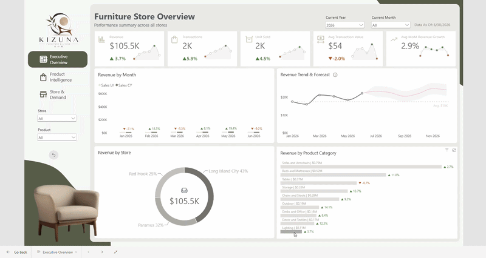
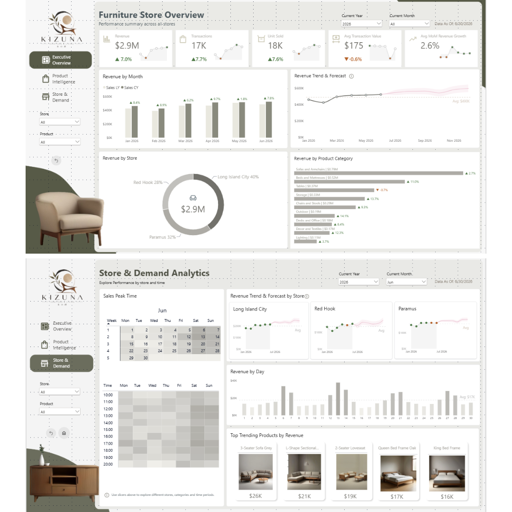
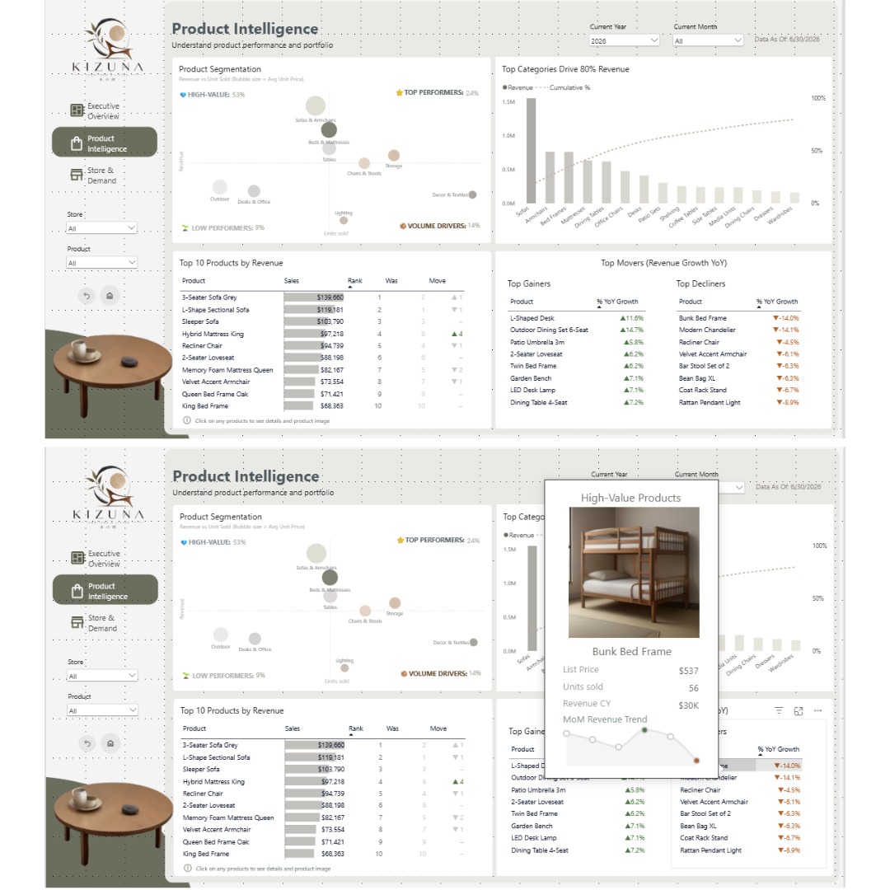

# Furniture Store Performance – Which branch performs best, and why?

Three branches, 18 monthly Excel files, one answer: the revenue gap comes from footfall, not from what people buy.



**[View on Maven Analytics](https://mavenanalytics.io/projects/57541)** · [Report export (PDF)](assets/report-export.pdf) · [Design plan](docs/dashboard-design-plan.md)

## Context

A furniture retailer with branches in Long Island City, Paramus and Red Hook supplied eighteen monthly transaction files (January 2025 – June 2026), a product list and a store list. The brief was an end-to-end Power BI build: data preparation, a proper semantic model, and a report that answers five questions:

- Which branch performs best, and is the gap explained by what customers buy or by how many customers there are?
- On which days and at which hours do the stores actually trade?
- Which products and categories generate revenue, and how concentrated is it?
- Which products are gaining ground and which are losing it year over year?
- Is the business growing, and does it show seasonality?

## Data

| Source | Rows | Notes |
|---|---|---|
| `data/transactions/*.xlsx` (18 files) | 50,200 | one row per transaction line, 10:00–20:00, 7 days/week |
| `data/Product.xlsx` | 80 | 9 categories, 33 product types, prices $19–$999 |
| `data/Store.xlsx` | 3 | |
| `data/Product_img.xlsx` | 80 | generated image URLs + prompts (see below) |

Totals: **$8,777,145 revenue · 50,200 transactions · 53,707 units · AOV $174.84**. Fictitious retailer; no cost, discount or customer-ID fields exist in the source.

## Results

- **The revenue gap is traffic, not merchandising.** Long Island City takes 39.8% of revenue, Paramus 32.1%, Red Hook 28.0% — but average order value is $175.07 / $174.36 / $175.08, category mix differs by ≤ 1.3 pp, and the hourly profiles are nearly identical. Three sizes of the same shop.
- **Weekends carry the business.** Saturday + Sunday = 46.3% of revenue; $26,066 per weekend day vs $12,079 per weekday (2.16×). Peak hour is 17:00 in every store, every day.
- **Revenue is concentrated in a fifth of the range.** 19 of 80 products make half of revenue, the top 10 make 31.9%, the bottom 20 make 8.3%. Sofas & Armchairs alone is $2.38M (27.1%).
- **Growth is modest but real.** H1 2026 closed at $2,939,238 vs $2,746,491 in H1 2025 (+7.0%). Monthly revenue ranges $390,918 (Feb 2025) – $575,150 (Nov 2025).
- **Baskets are tiny.** 1.07 units per transaction, 7.0% multi-item — revenue moves with footfall, not basket size.

## Report pages

| Executive Overview + Store & Demand | Product Intelligence (with image tooltip) |
|---|---|
|  |  |

1. **Executive Overview** — KPI cards with prior-year deltas and sparklines, monthly revenue vs LY, trend + forecast, store and category splits.
2. **Product Intelligence** — segmentation quadrant, Pareto chart with 80% line, top-10 with rank movement, top gainers / decliners YoY, report-page tooltip showing the product photo beside its monthly trend.
3. **Store & Demand** — per-store scorecards and forecast, revenue by calendar day, day × hour heat map, top trending products with images.

Slicers are synced across pages; a custom theme (warm Japandi palette, one type family, matched SVG icon set) means new visuals inherit the formatting.

## Approach

**Power Query**
- Folder connector over the 18 monthly files so a new month is a refresh, not a rebuild.
- `transaction_time` is a *time* value in the 2025 files and *text* in the 2026 files — auto-detect produces ~16,800 errors. Forced to text, then parsed explicitly.
- Store key mismatch (`store_id` vs `location_id`) fixed on load; `Sales` materialised as a column.

**Model** — star schema: `FACT_Transaction` (50,200) with `DIM_product`, `DIM_store`, `DIM_date`, `DIM_img`, `_Measures`. Auto date/time off, one marked date table; model stays at 2.5 MB. `Furniture-Sales-Performance.vpax` is the model export.

**DAX (~50 measures)** — four worth calling out:
- Segmentation thresholds use the **median within each category**, not a global average — across a $19–$999 range a single threshold just sorts by price.
- **Rank movement** compares current vs prior-period rank, surfacing products slipping while still in the top half.
- MoM growth is **compounded**, not averaged (+20% then −20% is −4%, not 0%).
- YoY measures are **guarded**: the calendar is 18 months, so 2025 returns "n/a" instead of a blank card or a misleading 0%.

**Product images** — the dataset had names but no pictures, so [`scripts/generate_product_images.py`](scripts/generate_product_images.py) generates one photo per product with FLUX via the Pollinations API. Every prompt gets the same style block (white background, high-key studio light, three-quarter angle, no props), and each request is seeded with the product id so the 80-image set regenerates identically. The script is idempotent and resumable, re-encodes through Pillow, and writes the public URLs back into `Product_img.xlsx`, where the column is typed as *Image URL* for Power BI. Images are generated, not real product photography.

## What the data cannot tell you

No cost field → no margin or profitability view. No list-price reference or promotion flag → discounting cannot be measured. No customer ID → no repeat-purchase or segmentation analysis. These gaps were left visible rather than estimated.

## Stack

Power BI Desktop · Power Query (M) · DAX · Python (requests, Pillow, openpyxl) · FLUX via Pollinations

## Run it

1. Open `Furniture-Sales-Performance.pbix` in Power BI Desktop (June 2025 or later).
2. If prompted, repoint the folder source to `data/transactions/` and the three workbooks in `data/`.
3. To regenerate images: `pip install requests pillow openpyxl` then `python scripts/generate_product_images.py --help`.

## Structure

```
powerbi-furniture-store-performance/
├── Furniture-Sales-Performance.pbix
├── Furniture-Sales-Performance.vpax     # model export (tables, measures)
├── data/                                # 18 monthly files + product / store / image workbooks
├── scripts/generate_product_images.py   # FLUX image generator + palette.txt
├── assets/                              # GIF, page PNGs, report PDF, generated product images, icons
└── docs/                                # design plan, Maven entry, technique inventory
```
